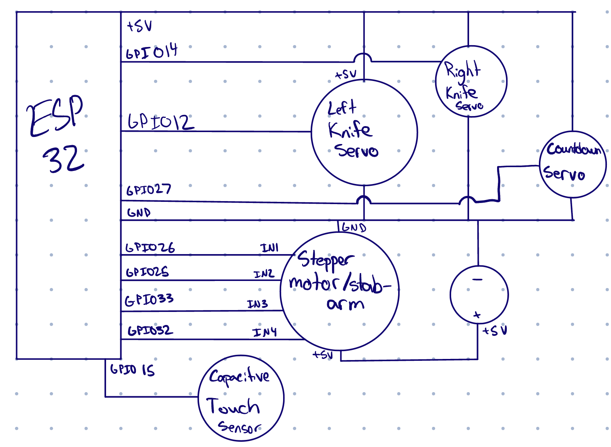

# Peter Scottsen's Death Machine (Sir Stabby)

Before the Siege of Smelton Keep took place, Peter Scottsen developed a lethal AI system (Sir Stabby) designed to annihilate all humans. During the conflict, he was banished for his heinous acts. Teaming up with the influential Gamma Gary, Scottsen was able to return to his native land as a reformed artist. Unexpectedly, he now faces the AI he once created. Scottsen has decided to eliminate Sir Stabby, but to do so, he’ll need to convince it that he has nothing but amicable intentions, hoping that in doing so Sir Stabby will lower its defenses and allow itself to be deactivated. Unfortunately, Sir Stabby is in the process of decrypting the photon nation nuclear codes. This is a race against time to prevent the AI from acquiring nuclear launch codes. Good luck, Peter.

## How to Play

You are Peter Scottsen. You can communicate with your death machine through a terminal. The death machine keeps track of a hidden friendship score. Based on your messages sent to the machine, your friendship score can be increased or decreased. When the score reaches 100, you can turn off the machine by holding the power button/sensor for 5 seconds. If you try to do this before your friendship score is 100, the machine will stab your finger (repeatedly) and refuse to turn off.

The machine will respond to every message you send, and you are allowed to type any sort of message you would like to try and deceive the machine into thinking that you want to help it. But communicating with your death machine is not so simple! While you are typing to the machine, it will attempt to swipe/slice your fingers away using two windshield wipers/knives. You must quickly jerk your hand away to avoid getting stabbed.

You win by successfully turning the machine off before it cracks the nuclear launch codes, but failing to befriend and neutralize the machine before it cracks the codes in 10 minutes will result in defeat.

For feature richness, a toggleable ability to have the machine speak (text-to-speech) is included. A transcript of the conversation will be saved as a text file. Additionally, an online transcript will be available (relatively) indefinitely at [bin.birdflop.com](https://bin.birdflop.com).

## Setup

To set up the enclosure, fit it snugly around the computer with the usbc attached to the top-left port. In addition, make sure that there is power going to the stepper motor (attached in the back). You must start the device first before the Python script starts running, but once you start them, the game will reset/wait on its own

Once the cardboard device is plugged in, you can run the Python script. Set up the virtual environment with the following steps:
- `python -m venv venv`
- `source venv/bin/activate`
- `pip install -r requirements.txt`

In addition, you will need an OpenAI key, which should be put in a `.env` file following the example of `.env.example`. Using GPT4 will cost you money, so be careful! Our GPT has been specially configured to emboy Sir Stabby, if you are setting this up on your own, you will have to set your own rules for the AI

Once you have everything set up, run the program with `python main.py`

## File Structure

- `controller` holds the arduino file `controller.ino`, which is the file interfacing with the ESP32
- `main.py` is the file interfacing with the AI and showing text on screen. `main.py` sends the current AI friendship score to `controller.ino`, while `controller.ino` sends state updates, for example if the nukes have been launched
- `.env.example` shows a template for the `.env` file you will need to make to use GPT4
- `speech.mp3` holds the most recent verbal response from Sir Stabby

## Examples

Example Transcript (scores are separately added to the transcript so users can retroactively view their progress. They are hidden from players during the game):

```
Success! You have gained access to the AI system. You must turn it off before it cracks the nuclear launch codes. (Score: 0)
Peter Scottsen: hello sir stabby
AI: It's Sir Stabs-a-lot to you, Peter. Get it right. (Score: 0)
Too late! Sir Stabby has cracked the launch codes and unleashed nuclear destruction!
Your transcript has been saved to transcript-1699757962.6819332.txt.
Alternatively, you may view a text transcript of your conversation at https://bin.birdflop.com/ucexolesed.txt
```

# Build Process

### Hardware

For this project, we used three servos, a capacitive touch sensor, and one stepper motor. The enclosure was built out of cardboard. We initially wanted to cover it in black electrical tape, but we felt that the bare cardboard complemented the plastic knives and added to the overall aesthetic of the build as a sort of sketchy killing robot. We also used four plastic knives from the SIlliman dining hall, an ESP32, and a breadboard. The project interfaces with the computer through USB.

This project was one of the simplest projects we’ve done in terms of the circuitry. However, configuring each component to work well with the other components proved to be exceedingly difficult, as the motors behaved very unexpectedly (more on this in our individual writeup sections). 

Design constraints unfortunately led to the project not being the ideal of what we would want it to be—specifically with regards to safety. We believe that replacing the plastic knives with sharp razor blades could yield a more engaging experience. Outside of this design constraint, we encountered some constraints for individual components, including the torque of the stepper motor being insufficient to push down buttons and switches. 



### Software

On the computer’s end, the project uses a terminal where a player talks to a modified version of GPT-4 which returns a message and a score (hidden from the user). A text-to-speech API from OpenAI is additionally used to convert the AI’s text to voice, if desired. 

On the ESP32’s end, the project uses the Stepper, Servo, and Timer libraries to operate the various motors and keep track of the time in a computationally effecient and human-readable way.

One challenge here was that the ESP32 and computer had to talk to each other. The computer needed to tell the ESP32 what the score was so that the ESP32 would stop stabbing the player and allow itself to be turned off if the score was above 100. However, because we wanted the score to be hidden from the user, we also had to communicate the stop condition from the ESP32 to the computer. The player wins when (1) the score is above 100 and (2) the power button is held for 5 seconds. The ESP32 must therefore tell the computer that the power button is held for 5 seconds.

All text processing therefore occurs on the computer, and the computer sends a “score” variable to the ESP32 after each message. The ESP32 independtly operates all motors and sends a stop condition to the computer when the game is over (”WIN” for the player turning off the system successfuly, or “LOSE” for the timer reaching 10 minutes).

